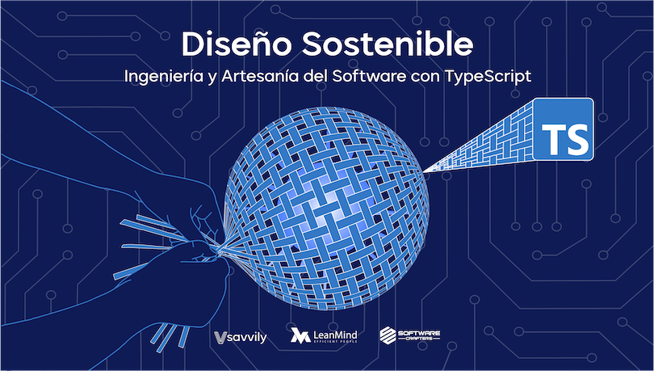

# Softwarecrafters - [Curso Diseño Sostenible](https://diseñosostenible.com)

## Kata Mars Rover

>**NOTA:** Plantilla para construir la base inicial del proyecto [aquí](https://github.com/softwarecrafters-io/ts-eslint-prettier-jest).

Ejercicio que pretende trabajar el sentido para tender a construir software sostenible, aplicando condiciones como:
- Uso de tipos especídificos (Value Object).
- Limitar uso de condicionales.
- Constructores con nombre en las clases.

Se realiza la simulación de control de un vehículo en Marte (Rover), el cual recibirá órdenes de movimiento y orientación desde la tierra y podrá de este modo desplazarse por el planeta.

- El planeta tiene unas dimensiones definidas en un plano 2D de coordenadas.
- No existen las coordenadas negativas, si no que se posiciona al otro lado del planeta.

---

* TypeScript
* Jest
* ESLint
* Prettier
* Husky

---
* `nvm use`
* `npm install`
* `npm test`

